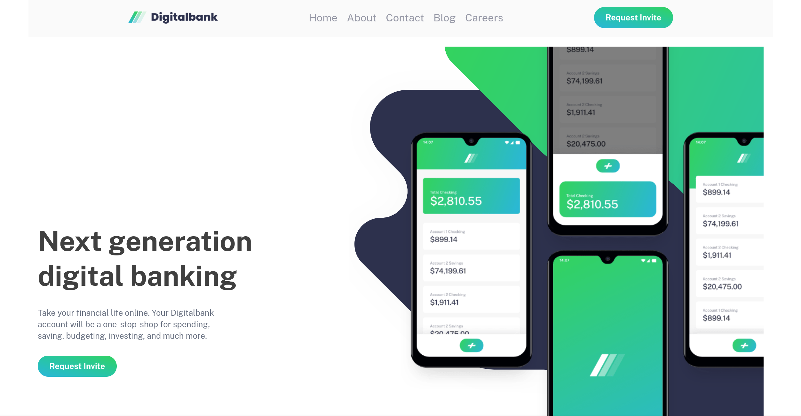
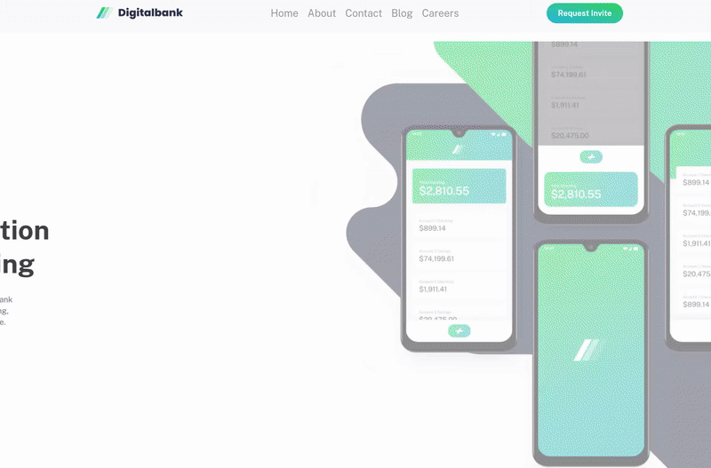

# Digitalbank Landing Page

A modern, fully responsive landing page for a digital banking service built with Alpine.js and Tailwind CSS v4.



## Overview

### The Challenge

Build a fully responsive landing page with:

- Mobile-first responsive design (mobile → tablet → desktop)
- Interactive elements with hover and focus states
- Smooth scroll animations
- Hamburger menu for mobile navigation

### Solution Highlights

- **Production-ready build setup** with esbuild for optimal performance
- **Scroll animations** using AOS library with cascade effects
- **Custom Tailwind variants** (`hocus:`) for combined hover/focus states
- **Animated navigation** with custom underline effects using CSS pseudo-elements
- **Separate CSS/JS bundles** for better caching and load times

## Built With

### Core Technologies

- **Alpine.js** - Lightweight reactive framework for interactivity
- **Tailwind CSS v4** - Utility-first CSS with custom variants
- **esbuild** - Fast JavaScript bundler

### Additional Libraries

- **AOS (Animate On Scroll)** - Scroll-triggered animations
- **Prettier** - Code formatting with Tailwind class sorting

### Development Tools

- **npm-run-all** - Parallel script execution
- **VSCode** - Configured with Tailwind IntelliSense and format-on-save

## Key Features

### Responsive Design

Mobile-first approach with three breakpoints:

- Mobile: Base styles
- Tablet (768px+): Adjusted layouts
- Desktop (1024px+): Full layout with navigation

### Interactive Elements

- Smooth hamburger menu with Alpine.js transitions
- Hover effects on cards with scale and shadow
- Animated navigation underline using `::before` pseudo-elements
- Scroll-triggered animations with staggered delays

### Technical Implementation

**Scroll Animations:**

```html
<div data-aos="fade-down" data-aos-delay="0">Feature 1</div>
<div data-aos="fade-down" data-aos-delay="100">Feature 2</div>
<div data-aos="fade-down" data-aos-delay="200">Feature 3</div>
```

**Custom Tailwind Variant:**

```css
@variant hocus (&:hover, &:focus);
```

**Navigation Underline Effect:**

```css
.header-links a {
  @apply hocus:text-black hocus:before:w-full relative before:absolute before:-bottom-1 before:h-1 before:w-0 before:bg-green-500 before:transition-all;
}
```

## Development Process

### What I Learned

**1. Production Build Setup**

- Implemented separate CSS/JS bundling for optimal caching
- Configured esbuild to automatically detect and bundle AOS CSS
- Set up parallel watch modes for Tailwind and JavaScript

**2. Tailwind v4 Workflows**

- Discovered `@variant` directive for custom variants (v4 way vs v3 plugins)
- Leveraged `@apply` with pseudo-elements for complex hover effects
- Configured Prettier to preserve HTML comments and attribution text

**3. Alpine.js Patterns**

- Used `x-transition` for smooth menu animations
- Implemented scroll locking with `overflow-hidden` on body
- Managed component state with Alpine's reactivity system

### Challenges & Solutions

**Challenge:** Tailwind class suggestions not working in Alpine `:class` bindings

**Solution:** Added experimental regex to VSCode settings:

```json
"tailwindCSS.experimental.classRegex": [
  ["class:\\s*?[\"'`]([^\"'`]*).*?[\"'`]", "[\"'`]([^\"'`]*).*?[\"'`]"]
]
```

**Challenge:** Full-width footer inside max-width container

**Solution:** Used absolute positioned divs with `w-screen` and negative transforms:

```html
<div class="absolute -z-20 w-screen bg-blue-950"></div>
<div class="absolute -z-20 w-screen -translate-x-[100vw] bg-blue-950"></div>
```

**Challenge:** Separate hero images for mobile/desktop without complex responsive logic

**Solution:** Created two separate blocks with visibility classes:

```html
<div class="md:hidden">Mobile Hero</div>
<div class="hidden md:block">Desktop Hero</div>
```

## Project Structure

```
digitalbank-landing-page/
├── src/
│   ├── js/
│   │   └── main.js           # Alpine + AOS initialization
│   └── styles/
│       ├── input.css         # Tailwind source with custom variants
│       └── tailwind.css      # Compiled output
├── dist/
│   ├── bundle.js             # Bundled JavaScript
│   └── aos.css               # AOS styles (auto-generated)
├── assets/images/            # Project images
├── build.js                  # esbuild configuration
├── tailwind.config.js        # Tailwind configuration
└── index.html                # Main page
```

## Performance

- **Separate CSS/JS bundles** for efficient caching
- **Minified production builds** with esbuild
- **Mobile-first approach** for optimal mobile experience
- **Lazy-loaded animations** with AOS (only trigger when in viewport)

## Screenshots

### Desktop



### Mobile


## Links

[](https://your-username.github.io/digitalbank-landing/)

## Author

- Frontend Mentor - [@KnightlyWorks](https://www.frontendmentor.io/profile/KnightlyWorks)
- GitHub - [@KnightlyWorks](https://github.com/KnightlyWorks)

---

_This project was built as part of my journey learning modern web development. Feel free to explore the code and reach out if you have questions!_
